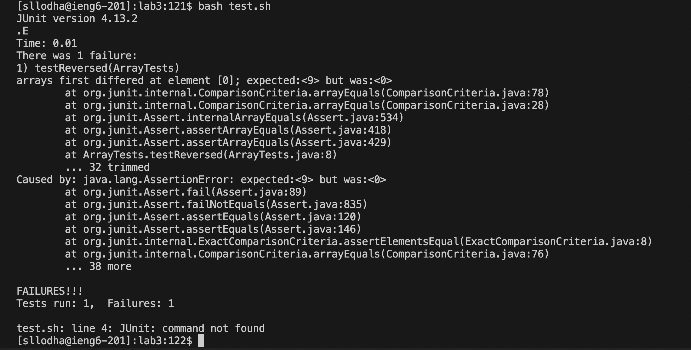
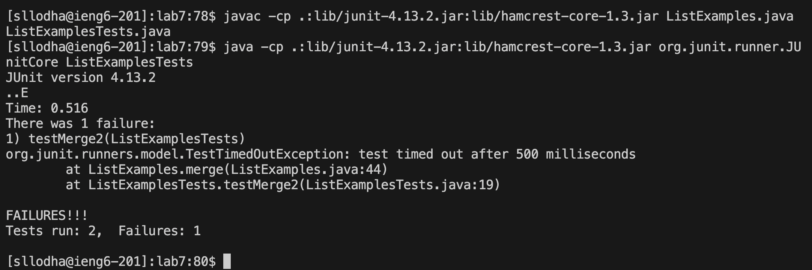
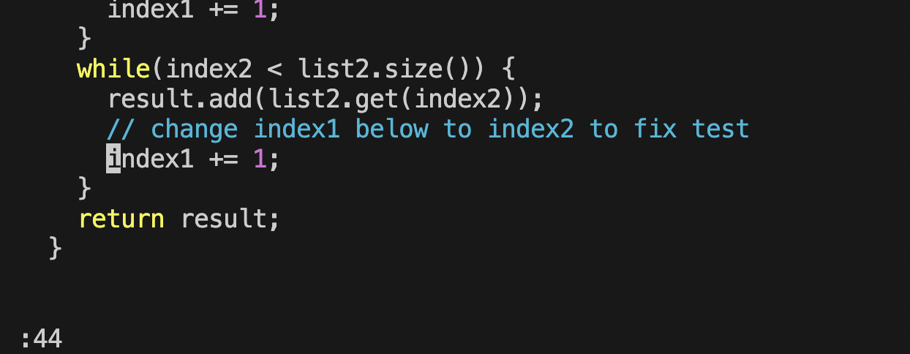
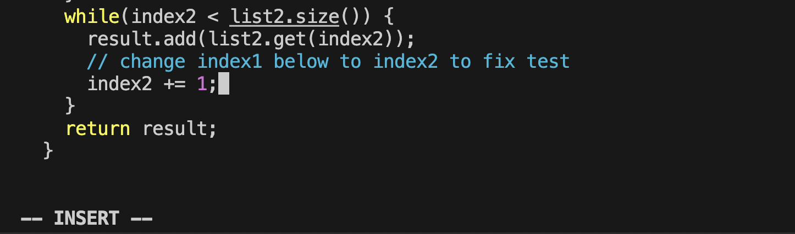
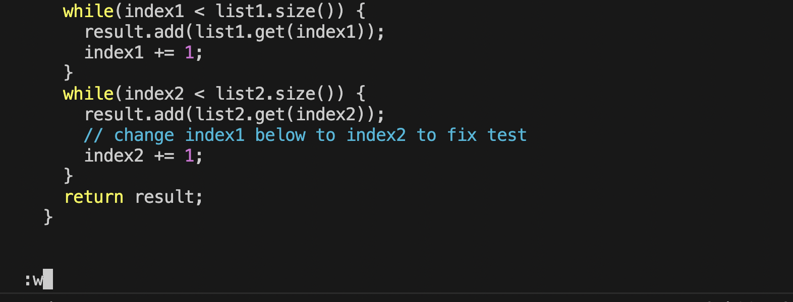
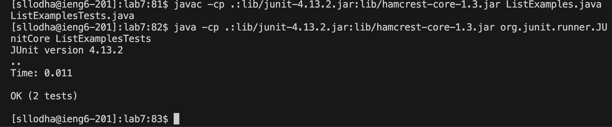
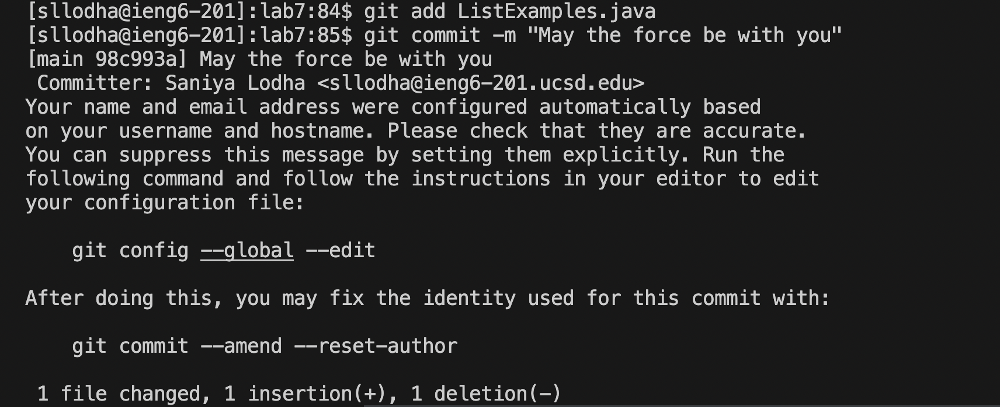

# LAB REPORT 4
### NAME: SANIYA LODHA
## ```vim```




#### 1. Logged into ieng6 using ``` ssh sllodha@ieng6.ucsd.edu ```
#### 2. Cloned into the forked repository using the command ``` git clone https://github.com/sanyalodha/lab7 ```
#### 3. Used the ```cd``` and ```ls``` command to check for relevant files



#### 4. Used the command ``` javac -cp .:lib/junit-4.13.2.jar:lib/hamcrest-core-1.3.jar ListExamples.java ListExamplesTests.java ``` to compile ```ListExamples.java``` and ```ListExamplesTests.java```
#### 5. Used the command ```java -cp .:lib/junit-4.13.2.jar:lib/hamcrest-core-1.3.jar org.junit.runner.JUnitCore ListExamplesTests``` to run the test file.
#### Note: Take note of the failed tests and where the error has occurred
#### 6. Used the command ```vim ListExamples.java``` to enter vim mode




#### 7. Used the command ```:44``` and the key ```<enter>``` to skip to the line that has the error



#### 8. Used command ```i``` and the key ```<enter>``` to enter into insert mode in vim
#### 9. Changed the line ```index1 += 1 ``` to ```index2 += 1``` to fix the bug in the code




#### 10. Used command ```esc``` to exit insert mode and Used the command ```:w``` to save the changes made in the file.
#### 11. Used ```:q``` and the key ```<enter>``` to exit vim mode and go back to the terminal



#### 12. Keys Pressed: ```<up><up><up><enter>``` to traverse through the terminal history and compile the files ```ListExamples.java``` and ```ListExamplesTests.java``` using the command ``` javac -cp .:lib/junit-4.13.2.jar:lib/hamcrest-core-1.3.jar ListExamples.java ListExamplesTests.java ``` which was 3 up.
#### 13. Keys Pressed: ```<up><up><up><enter>``` to traverse through the terminal history and run the file ```ListExamplesTests.java``` using command ```java -cp .:lib/junit-4.13.2.jar:lib/hamcrest-core-1.3.jar org.junit.runner.JUnitCore ListExamplesTests``` which was 3 up.

#### Note: Note the tests have passed, so there is no bug in  ```ListExamples.java``` anymore.



#### 14. Used the command ``` git add ListExamples.java``` to add file to the gitHub
#### 15. Lastly, used the command ```git commit -m "May the force be with you" ``` to commit our changes and end with the message "May the force be with you".


