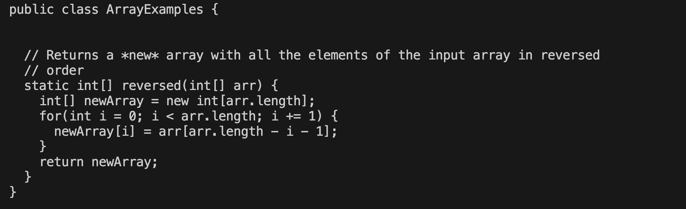

# LAB 5
## Name: Saniya Lodha
## Part 1: Debugging Scenario


### Orignal Post by FrodoBaggins69:

#### Hello, I can't seem to figure out why my test is failing for the reversed method. I think it has something to do with the return statement in my code but I'm not sure.


### TA: Your code seems pretty much on point right up till the point where you're assigning the values to the ``` newArray ```. According to the method description, you should be updating the ``` newArray `` and returning the same as well. Could you try doing that and see if your tests are still failing. 

### FrodoBaggins69: So I edited my code to update ``` newArray ``` but even after running my test.sh bash file again, it fails. What could I do next?



### TA: It seems like your code is right, can you make sure your bash script file correctly compiles all your java files involved in this as your tests may be failing because your files were not compiled properly. Your test.sh script should have commands as follows:
### ```javac -cp .:lib/hamcrest-core-1.3.jar:lib/junit-4.13.2.jar *.java```
### ```java -cp .:lib/hamcrest-core-1.3.jar:lib/junit-4.13.2.jar org.junit.runner.JUnitCore ArrayTests JUnit version 4.13.2``` 

### FrodoBaggins69: That was it! I realised I was only compiling ArrayTests when I should have compiled all my java files. Thank you, my code is working now! You're absolutely godsend!!


## Contents:

### File and directory structure needed
```
lab3 (directory)
      -> ArrayExamples.java
      -> ArrayTests.java
      -> test.sh
```

### Contents of each file before fixing bug:

#### Contents of ArrayExamples.java
```
public class ArrayExamples {


  // Returns a *new* array with all the elements of the input array in reversed
  // order
  static int[] reversed(int[] arr) {
    int[] newArray = new int[arr.length];
    for(int i = 0; i < arr.length; i += 1) {
      arr[i] = newArray[arr.length - i - 1];
    }
    return arr;
  }
}
```

#### Contents of ArrayTests.java
```
import static org.junit.Assert.*;
import org.junit.*;

public class ArrayTests {
  @Test
  public void testReversed() {
    int[] input1 = {2,0,1,9 };
    assertArrayEquals(new int[]{9,1,0,2 }, ArrayExamples.reversed(input1));
  }
}
```

#### Contents of test.sh

```

javac -cp .:lib/hamcrest-core-1.3.jar:lib/junit-4.13.2.jar ArrayTests.java

java -cp .:lib/hamcrest-core-1.3.jar:lib/junit-4.13.2.jar org.junit.runner.JUnitCore ArrayTests

```


### Command line arguments to trigger the bug

``` bash test.sh ```

### What to edit to fix the bug

To fix the bug, we need to edit the ```reversed``` method in ```ArrayExamples.java```. As we can see, the method needs to be updating indexes in the ```newArray``` but instead it is updating the old array itself. So we will update the newArray instead and instead of returning ```arr```, we must return ```newArray```. 

## Part 2: Reflection

I think the coolest thing I learned was the ```vim``` command. I was very stoked to see that I could edit a file straight from the command line using the ```insert``` method in ```vim```. I also like the fact that I can undo my changes in ```vim``` which is very helpful since I tend to make silly mistakes. I also like how we can enter our commands into a bash script, this was extremely helpful in running tests since the code for running tests is very long and hard to remember.
Overall, I found the class very helpful and I definitely see myself using these commands in the future. 


