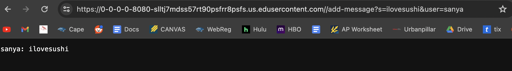
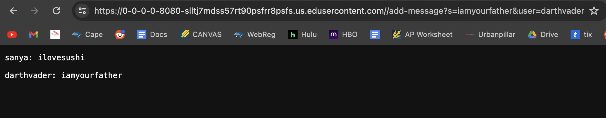
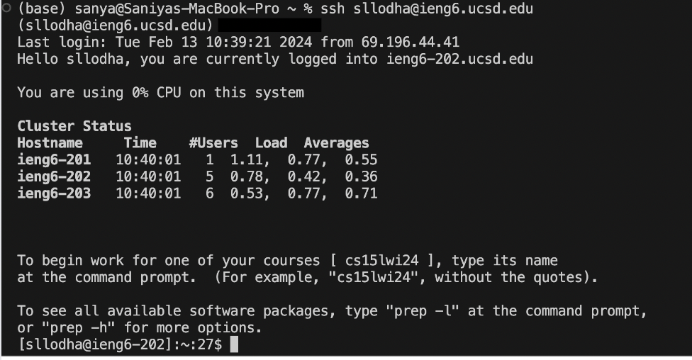

# LAB REPORT 2
## PART 1

### ChatServer
```
import java.io.IOException;
import java.net.URI;
import java.io.BufferedWriter;
import java.io.File;
import java.io.FileWriter;

interface URLHandler {
    String handleRequest(URI url);
}

class ChatHandler implements URLHandler {
    String chatHistory = "";

    public String handleRequest(URI url) {
        // expect /add-message?s=<string>&user=<string>
        if (url.getPath().equals("/add-message")) {
            String[] params = url.getQuery().split("&");
            String[] shouldBeUser = params[1].split("=");
            String[] shouldBeMessage = params[0].split("=");
            if (shouldBeUser[0].equals("user") && shouldBeMessage[0].equals("s")) {
                String user = shouldBeUser[1];
                String message = shouldBeMessage[1];
                this.chatHistory += user + ": " + message + "\n\n";
                return this.chatHistory;
            } else {
                return "Invalid parameters: " + String.join("&", params);
            }
        }
        return "404 Not Found";
    }
}

class ChatServer {
    public static void main(String[] args) throws IOException {
        int port = Integer.parseInt(args[0]);
        Server.start(port, new ChatHandler());
    }
}

```

## Example 1



### Which methods in your code are called?

In this case, the ```handleRequest(URI url)``` method is called on where it accesses the add-message condition since it renders true.

### What are the relevant arguments to those methods, and the values of any relevant fields of the class?

The relevant argument would be the ```(URI url)``` parameter which utilizes the URL. Then, the "user" and "s" query parameters are found through the method.
Here the value of ```s``` is ```ilovesushi``` and the value of ```user``` is ```sanya```. 

### How do the values of any relevant fields of the class change from this specific request? If no values got changed, explain why.

For each query, the value of ```shouldBeUser``` and ```shouldBeMessage``` change so in this case, ```shouldBeUser``` holds the value ```sanya``` and 
```shouldBeMessage``` holds the value ```ilovesushi```. These variables are updated along with the ```user``` and ```message``` variables for each query. 
Lastly, the ```chatHistory``` is also updated so that it stores all the chats and their outputs.

## Example 2



### Which methods in your code are called?

In this case, the ```handleRequest(URI url)``` method is called on where it accesses the add-message condition since it renders true.

### What are the relevant arguments to those methods, and the values of any relevant fields of the class?

The relevant argument would be the ```(URI url)``` parameter which utilizes the URL. Then, the "user" and "s" query parameters are found through the method.
Here the value of ```s``` is ```iamyourfather``` and the value of ```user``` is ```darthvader```. 

### How do the values of any relevant fields of the class change from this specific request? If no values got changed, explain why.

For each query, the value of ```shouldBeUser``` and ```shouldBeMessage``` change so in this case, ```shouldBeUser``` holds the value ```darthvader``` and 
```shouldBeMessage``` holds the value ```iamyourfather```. These variables are updated along with the ```user``` and ```message``` variables for each query. 
Lastly, the ```chatHistory``` is also updated so that it stores all the chats and their outputs. In this case, the chatHistory shows 2 chats.

## PART 2

### The absolute path to the private key for your SSH key for logging into ieng6 (on your computer, an EdStem workspace, or on the home directory of the lab computer)


### The absolute path to the public key for your SSH key for logging into ieng6 (this is the one you copied to your account on ieng6, so it should be a path on ieng6's file system)


### A terminal interaction where you log into your ieng6 account without being asked for a password.



## PART 3

### In a couple of sentences, describe something you learned from lab in week 2 or 3 that you didn't know before.

I would say I didn't know how to build and run a server and I was able to learn that in the labs. Even the simple server like NumberServer was 
very new to me. I also learned how to access URL's through the ```curl``` command which I found was very useful in this class as well as in other projects.
Lastly, I learned about the ```mkdir``` command which has been very useful in creating new directories.


