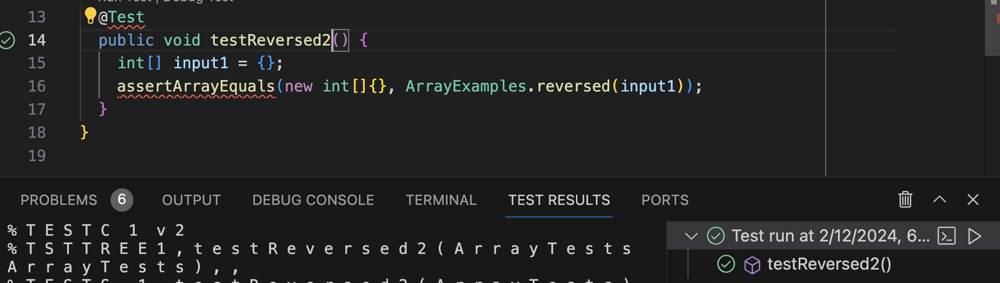

# LAB REPORT 3: SANIYA LODHA
***
## Part 1
### Bug Chosen: ```reversed```
### 1. A failure-inducing input for the buggy program, as a JUnit test and any associated code (write it as a code block in Markdown)

```
@Test
  public void testReversed2() {
    int[] input1 = {4,3,2,1};
    assertArrayEquals(new int[]{1,2,3,4}, ArrayExamples.reversed(input1));
  }
```
### 2. An input that doesn't induce a failure, as a JUnit test and any associated code (write it as a code block in Markdown)
```
@Test
  public void testReversed2() {
    int[] input1 = {};
    assertArrayEquals(new int[]{}, ArrayExamples.reversed(input1));
  }
```
### 3. The symptom, as the output of running the tests (provide it as a screenshot of running JUnit with at least the two inputs above)

Input inducing a failure:


Input NOT inducing a failure:



### 4. The bug, as the before-and-after code change required to fix it (as two code blocks in Markdown)

Before:

```

  static int[] reversed(int[] arr) {
    int[] newArray = new int[arr.length];
    for(int i = 0; i < arr.length; i += 1) {
      arr[i] = newArray[arr.length - i - 1];
    }
    return arr;
  }

```

After:

```

  static int[] reversed(int[] arr) {
    int[] newArray = new int[arr.length];
    for(int i = 0; i < arr.length; i += 1) {
      newArray[arr.length - i - 1] = arr[i];
    }
    return newArray;
  }

```
### Briefly describe why the fix addresses the issue.

The issue with the code before was that it was assigning the elements of ```newArray``` to ```arr``` instead of 
assigning the reversed elements of ```arr``` to ```newArray```. It also returns ```arr``` which is our orignal 
unchanged array.

## Part 2

### Command: ```find```

### 1. -type
#### Example 1:
Input:
```
[user@sahara ~/docsearch/technical]$ find . -type d
```
Output:
```
.
./911report
./biomed
```
What it's doing?
This argument finds the files of the specified type. Here, we are in the technical directory and the command is specified to find the type d
which is short for directory. This command returns all the directories in the techical directory.

#### Example 2:

Input:
```
[user@sahara ~/docsearch/technical]$ find . -type f
```
Output:
```
./911report/chapter-3.txt
./911report/chapter-11.txt
./911report/chapter-13.5.txt
./911report/chapter-9.txt
./911report/chapter-7.txt
./911report/chapter-8.txt
./911report/chapter-13.1.txt
./911report/chapter-5.txt
./911report/chapter-10.txt
./911report/chapter-13.2.txt
./911report/chapter-6.txt
./911report/preface.txt
./911report/chapter-2.txt
./911report/chapter-12.txt
./911report/chapter-13.3.txt
./911report/chapter-1.txt
./911report/chapter-13.4.txt
./biomed/1471-2121-2-11.txt
./biomed/1471-213X-1-4.txt
./biomed/1471-2210-2-5.txt
./biomed/1472-6807-3-2.txt
./biomed/1471-230X-1-8.txt
./biomed/ar408.txt
./biomed/1471-2148-1-4.txt
./biomed/1472-6955-2-1.txt
./biomed/1471-2466-3-1.txt
./biomed/1471-2210-1-4.txt
./biomed/1471-2121-3-25.txt
./biomed/1472-6963-1-8.txt
./biomed/1471-2121-2-21.txt
./biomed/1472-6815-2-3.txt
./biomed/1471-2458-2-25.txt
./biomed/1471-2199-2-2.txt
./biomed/1471-2202-2-1.txt
./biomed/1471-2172-3-10.txt
./biomed/1472-6750-2-10.txt
./biomed/1471-2202-2-9.txt
./biomed/1471-2202-4-10.txt
./biomed/1471-2164-3-1.txt
./biomed/1471-2180-2-32.txt
./biomed/1471-2156-4-5.txt
./biomed/1471-2105-4-24.txt
./biomed/1471-2334-1-9.txt
./biomed/ar118.txt
./biomed/1477-7827-1-23.txt
./biomed/1471-2164-3-15.txt
./biomed/1472-6793-2-2.txt
./biomed/1471-2164-3-4.txt
./biomed/bcr458.txt
./biomed/1471-2431-2-11.txt
./biomed/1471-2164-3-29.txt
./biomed/1471-2091-3-14.txt
./biomed/1471-213X-2-1.txt
./biomed/1471-2407-1-19.txt
./biomed/1471-2202-4-6.txt
./biomed/1471-2164-3-7.txt
./biomed/1471-2180-2-29.txt
./biomed/1471-2164-3-19.txt
./biomed/1475-2875-2-4.txt
./biomed/ar774.txt
./biomed/1472-6831-2-2.txt
./biomed/1477-7827-1-27.txt
./biomed/1471-2156-3-17.txt
./biomed/1471-2121-3-8.txt
./biomed/1472-6890-3-2.txt
./biomed/1471-2202-4-11.txt
./biomed/1472-6882-2-10.txt
./biomed/1471-2199-4-5.txt
./biomed/1471-2164-2-7.txt
./biomed/1471-2334-2-29.txt
./biomed/1468-6708-3-3.txt

```
What it's doing?
This argument finds the files of the specified type. Here, we are in the technical directory and the command is specified to find the type f
which is short for regular files. This command returns all the regular files in the techical directory.

### 2. -size
#### Example 1:
Input:
```
[user@sahara ~/docsearch/technical]$  find . -type f -size +100k
```
Output:
```
./911report/chapter-3.txt
./911report/chapter-13.5.txt
./911report/chapter-9.txt
./911report/chapter-7.txt
./911report/chapter-13.2.txt
./911report/chapter-6.txt
./911report/chapter-12.txt
./911report/chapter-13.3.txt
./911report/chapter-1.txt
./911report/chapter-13.4.txt
./biomed/1471-2105-3-2.txt

```
What it's doing?

This command filters the size and finds the files that match the specified size. Here, the command line adds a filter of ```-type``` to get only
regular files, and the ```-size``` with ```+100k``` command filters out the files in the technical directory to only find the files that are more than 100 kilobytes.

#### Example 2:
Input:
```
[user@sahara ~/docsearch/technical]$  find . -type f -size -2c
```
Output:
```
./biomed/ar408.txt
./biomed/ar118.txt
./biomed/1477-7827-1-23.txt
./biomed/bcr458.txt
./biomed/ar774.txt
./biomed/1477-7827-1-27.txt
./biomed/1476-069X-2-9.txt
./biomed/1476-5918-1-2.txt
./biomed/ar328.txt
./biomed/bcr285.txt
./biomed/bcr284.txt
./biomed/1476-4598-2-20.txt
./biomed/1476-9433-1-3.txt
./biomed/1476-9433-1-2.txt
./biomed/1475-925X-2-11.txt
./biomed/bcr620.txt
./biomed/ar79.txt
./biomed/ar601.txt
./biomed/ar619.txt
./biomed/bcr303.txt
./biomed/bcr317.txt
./biomed/1477-7827-1-48.txt
./biomed/ar422.txt
./biomed/ar430.txt
./biomed/bcr568.txt
./biomed/1475-9268-1-1.txt
./biomed/ar778.txt
./biomed/1476-069X-2-2.txt
./biomed/ar624.txt
./biomed/1476-069X-2-7.txt
./biomed/1475-925X-2-12.txt
./biomed/ar321.txt
./biomed/ar429.txt
./biomed/1477-7827-1-31.txt
./biomed/1476-4598-2-25.txt
./biomed/1478-1336-1-2.txt
./biomed/ar387.txt
./biomed/ar93.txt
./biomed/1476-4598-2-2.txt
./biomed/1477-7827-1-13.txt
./biomed/bcr588.txt
./biomed/ar149.txt
./biomed/1477-7827-1-6.txt
./biomed/1477-7827-1-21.txt
./biomed/ar612.txt
./biomed/1476-4598-1-8.txt
./biomed/bcr618.txt
./biomed/1477-5956-1-1.txt
./biomed/1478-1336-1-3.txt
./biomed/ar140.txt
./biomed/bcr294.txt
./biomed/1475-925X-2-6.txt
./biomed/bcr607.txt
./biomed/1476-072X-2-4.txt
./biomed/ar331.txt
./biomed/1477-7827-1-54.txt
./biomed/1477-7827-1-17.txt
./biomed/bcr635.txt
./biomed/1477-7525-1-12.txt
./biomed/ar319.txt
./biomed/bcr602.txt
./biomed/1476-4598-2-24.txt
./biomed/ar309.txt
./biomed/ar383.txt
./biomed/1478-1336-1-4.txt
./biomed/ar68.txt
./biomed/1476-069X-1-3.txt
./biomed/ar615.txt
./biomed/ar745.txt
./biomed/ar407.txt
./biomed/1476-511X-2-2.txt
./biomed/ar795.txt
./biomed/1477-7827-1-46.txt
./biomed/1476-0711-2-7.txt
./biomed/1476-511X-1-2.txt
./biomed/1478-7954-1-3.txt
./biomed/1476-072X-2-3.txt
./biomed/bcr631.txt
./biomed/1475-9268-1-2.txt
./biomed/ar120.txt
./biomed/1475-925X-2-1.txt
./biomed/bcr45.txt
./biomed/bcr273.txt
./biomed/1477-7827-1-43.txt
./biomed/1476-4598-2-28.txt
./biomed/ar130.txt
./biomed/1477-7827-1-36.txt
./biomed/bcr570.txt
./biomed/1476-511X-2-3.txt
./biomed/bcr583.txt
./biomed/ar104.txt
./biomed/1476-4598-2-3.txt
./biomed/1475-925X-2-10.txt
./biomed/1476-4598-2-1.txt
./biomed/ar792.txt
./biomed/1476-0711-2-3.txt
./biomed/bcr571.txt
./biomed/1476-4598-1-5.txt
./biomed/1477-7827-1-9.txt
./biomed/1476-4598-1-6.txt
./biomed/1476-4598-2-22.txt
./biomed/1477-7525-1-9.txt
./biomed/ar799.txt
./biomed/1477-7819-1-10.txt
./biomed/ar750.txt
./biomed/1476-4598-1-3.txt
./biomed/bcr567.txt
./biomed/ar297.txt
./biomed/ar409.txt
./biomed/1476-069X-2-4.txt
./biomed/1475-925X-2-3.txt
./biomed/bcr605.txt
./biomed/1477-7525-1-10.txt
./biomed/1475-9276-1-3.txt
```
What it's doing?
This command filters the size and finds the files that match the specified size. Here, the command line adds a filter of ```-type``` to get only
regular files, and the ```-size``` with ```-2c``` command filters out the files in the technical directory to only find the files that are less than 2 bytes.


### 3. -regex

#### Example 1:
Input:
```
[user@sahara ~/docsearch/technical]$ find -type f -regex '.*\chapter.*'
```
Output:
```
./911report/chapter-3.txt
./911report/chapter-11.txt
./911report/chapter-13.5.txt
./911report/chapter-9.txt
./911report/chapter-7.txt
./911report/chapter-8.txt
./911report/chapter-13.1.txt
./911report/chapter-5.txt
./911report/chapter-10.txt
./911report/chapter-13.2.txt
./911report/chapter-6.txt
./911report/chapter-2.txt
./911report/chapter-12.txt
./911report/chapter-13.3.txt
./911report/chapter-1.txt
./911report/chapter-13.4.txt

```
What it's doing?

This ``` regex ``` command searches for files matching the expression specified, which in this case is ```'.*\chapter.*'```. The type command will filter out to 
return only the regular files, while the regex command finds all the files in the technical directory that start with the expression "chapter".

#### Example 2:
Input:
```
[user@sahara ~/docsearch/technical]$ find -type f -regex '.*\.txt'
```
Output:
```
./911report/chapter-3.txt
./911report/chapter-11.txt
./911report/chapter-13.5.txt
./911report/chapter-9.txt
./911report/chapter-7.txt
./911report/chapter-8.txt
./911report/chapter-13.1.txt
./911report/chapter-5.txt
./911report/chapter-10.txt
./911report/chapter-13.2.txt
./911report/chapter-6.txt
./911report/preface.txt
./911report/chapter-2.txt
./911report/chapter-12.txt
./911report/chapter-13.3.txt
./911report/chapter-1.txt
./911report/chapter-13.4.txt
./biomed/1471-2121-2-11.txt
./biomed/1471-213X-1-4.txt
./biomed/1471-2210-2-5.txt
./biomed/1472-6807-3-2.txt
./biomed/1471-230X-1-8.txt
./biomed/ar408.txt
./biomed/1471-2148-1-4.txt
./biomed/1472-6955-2-1.txt
./biomed/1471-2466-3-1.txt
./biomed/1471-2210-1-4.txt
./biomed/1471-2121-3-25.txt
./biomed/1472-6963-1-8.txt
./biomed/1471-2121-2-21.txt
./biomed/1472-6815-2-3.txt
./biomed/1471-2458-2-25.txt
./biomed/1471-2199-2-2.txt
./biomed/1471-2202-2-1.txt
./biomed/1471-2172-3-10.txt
./biomed/1472-6750-2-10.txt
./biomed/1471-2202-2-9.txt
./biomed/1471-2202-4-10.txt
./biomed/1471-2164-3-1.txt
./biomed/1471-2180-2-32.txt
./biomed/1471-2156-4-5.txt
./biomed/1471-2105-4-24.txt
./biomed/1471-2334-1-9.txt
./biomed/ar118.txt
./biomed/1477-7827-1-23.txt
./biomed/1471-2164-3-15.txt
./biomed/1472-6793-2-2.txt
./biomed/1471-2164-3-4.txt
./biomed/bcr458.txt
./biomed/1471-2431-2-11.txt
./biomed/1471-2164-3-29.txt
./biomed/1471-2091-3-14.txt
./biomed/1471-213X-2-1.txt
./biomed/1471-2407-1-19.txt
./biomed/1471-2202-4-6.txt
./biomed/1471-2164-3-7.txt
./biomed/1471-2180-2-29.txt
./biomed/1471-2164-3-19.txt
./biomed/1475-2875-2-4.txt
./biomed/ar774.txt
./biomed/1472-6831-2-2.txt
./biomed/1477-7827-1-27.txt
./biomed/1471-2156-3-17.txt
./biomed/1471-2121-3-8.txt
./biomed/1472-6890-3-2.txt
./biomed/1471-2202-4-11.txt
./biomed/1472-6882-2-10.txt
./biomed/1471-2199-4-5.txt
./biomed/1471-2164-2-7.txt
./biomed/1471-2334-2-29.txt
./biomed/1468-6708-3-3.txt
./biomed/1472-684X-2-1.txt
./biomed/1471-2164-2-4.txt
./biomed/1471-2458-1-9.txt
./biomed/1472-6920-1-3.txt
./biomed/1471-2199-2-3.txt
./biomed/1471-2369-4-5.txt
./biomed/1476-069X-2-9.txt
./biomed/1471-2350-4-6.txt
./biomed/1471-2164-3-9.txt
./biomed/1476-5918-1-2.txt
./biomed/1471-2121-3-4.txt
./biomed/1471-2490-3-2.txt
./biomed/1471-2148-3-18.txt
./biomed/1471-2105-3-2.txt
./biomed/1475-2867-3-12.txt
./biomed/1471-2091-3-8.txt
./biomed/ar328.txt
./biomed/1471-2180-1-28.txt
./biomed/1471-2091-3-22.txt
./biomed/bcr285.txt
./biomed/1472-6920-2-1.txt
./biomed/1471-2261-3-5.txt
./biomed/bcr284.txt
./biomed/1472-6807-2-4.txt
./biomed/1476-4598-2-20.txt
./biomed/1472-6963-3-14.txt
./biomed/1476-9433-1-3.txt
./biomed/1471-2210-2-4.txt
./biomed/1471-2229-1-2.txt
./biomed/1472-6947-1-5.txt
./biomed/1471-2350-4-2.txt
./biomed/1472-6793-2-18.txt
./biomed/1471-213X-3-4.txt
./biomed/1476-9433-1-2.txt
./biomed/1471-2334-1-10.txt
./biomed/1471-2350-2-2.txt
./biomed/1475-2832-1-1.txt
./biomed/1471-5945-1-3.txt
./biomed/1471-2180-2-13.txt
./biomed/1471-2202-1-1.txt
./biomed/1471-2210-2-9.txt
./biomed/1471-2474-4-4.txt
./biomed/1471-2350-3-9.txt
./biomed/1471-2261-2-11.txt
./biomed/1471-2172-3-4.txt
./biomed/1471-2105-3-37.txt
./biomed/1471-2202-2-8.txt
./biomed/1475-925X-2-11.txt
./biomed/1471-2156-3-4.txt
./biomed/1471-2202-3-16.txt
./biomed/1471-2415-3-1.txt
./biomed/1471-2121-3-18.txt
./biomed/bcr620.txt
./biomed/1472-6963-3-7.txt
./biomed/1475-2867-2-7.txt
./biomed/1471-2164-4-2.txt
./biomed/1471-230X-2-17.txt
./biomed/1472-6874-2-1.txt
./biomed/1471-2164-3-30.txt
./biomed/ar79.txt
./biomed/1471-2334-3-13.txt
./biomed/1468-6708-3-7.txt
./biomed/1471-2148-2-12.txt
./biomed/1471-213X-1-3.txt
./biomed/1472-6904-2-4.txt
./biomed/ar601.txt
./biomed/1472-6882-3-3.txt
./biomed/1471-2377-1-2.txt
./biomed/ar619.txt
./biomed/1471-2202-2-19.txt
./biomed/1471-2180-2-7.txt
./biomed/1471-2288-3-8.txt
./biomed/1471-2091-2-9.txt
./biomed/bcr303.txt
./biomed/1471-2229-2-8.txt
./biomed/1471-213X-3-2.txt
./biomed/1471-2202-2-20.txt
./biomed/1471-2156-2-5.txt
./biomed/1471-2148-2-15.txt
./biomed/1471-2334-3-10.txt
./biomed/1471-244X-2-9.txt
./biomed/1471-2148-1-14.txt
./biomed/1471-2172-3-1.txt
./biomed/1471-2253-2-4.txt
./biomed/1472-6882-3-1.txt
./biomed/bcr317.txt
./biomed/1472-6793-2-19.txt
./biomed/1471-2148-2-7.txt
./biomed/1471-2180-2-38.txt
./biomed/1471-2164-3-28.txt
./biomed/1477-7827-1-48.txt
./biomed/1471-2172-2-3.txt
./biomed/1471-2156-3-16.txt
./biomed/1472-6874-3-2.txt
./biomed/1471-2407-2-22.txt
./biomed/1471-2458-3-20.txt
./biomed/ar422.txt
./biomed/1472-6890-1-4.txt
./biomed/1471-2105-3-16.txt
./biomed/1472-6793-3-5.txt
./biomed/ar430.txt
./biomed/bcr568.txt
./biomed/1471-2164-4-14.txt
./biomed/1471-230X-3-3.txt
./biomed/1475-9268-1-1.txt
./biomed/1471-2148-1-6.txt
./biomed/ar778.txt
./biomed/1471-2121-3-6.txt
./biomed/1471-2202-2-10.txt
./biomed/1475-2875-2-14.txt
./biomed/1472-6793-3-3.txt
./biomed/1471-2121-2-3.txt
./biomed/1471-2156-3-22.txt
./biomed/1471-2350-2-11.txt
./biomed/1471-2350-2-8.txt
./biomed/1476-069X-2-2.txt
./biomed/1472-6793-1-11.txt
./biomed/1471-2121-3-10.txt
./biomed/1471-230X-1-6.txt
./biomed/1471-2199-3-3.txt
./biomed/1471-2164-2-6.txt
./biomed/1471-2350-2-12.txt
./biomed/1471-2148-2-2.txt
./biomed/1471-2172-2-9.txt
./biomed/ar624.txt
./biomed/1472-6785-2-6.txt
./biomed/1472-6920-2-3.txt
./biomed/1472-6890-2-5.txt
./biomed/1471-2164-3-13.txt
./biomed/1471-2148-2-8.txt
./biomed/1471-2180-1-8.txt
./biomed/1471-2164-3-18.txt
./biomed/1472-6793-1-15.txt
./biomed/1472-6963-3-13.txt
./biomed/1471-2180-1-33.txt
./biomed/1472-6882-1-10.txt
./biomed/1471-2334-2-1.txt
./biomed/1471-2202-3-7.txt
./biomed/1471-2091-2-11.txt
./biomed/1471-213X-1-9.txt
./biomed/1471-2121-2-12.txt
./biomed/1471-2105-3-6.txt
./biomed/1471-2369-3-9.txt
./biomed/1471-2334-3-11.txt
./biomed/1471-2180-3-13.txt
./biomed/1472-6750-1-11.txt
./biomed/1471-2202-2-3.txt
./biomed/1471-2202-4-2.txt
./biomed/1471-2091-2-13.txt
./biomed/1471-2164-3-16.txt
./biomed/1476-069X-2-7.txt
./biomed/1471-2164-3-33.txt
./biomed/1472-6793-3-6.txt
./biomed/1471-2164-3-24.txt
./biomed/1471-2210-3-1.txt
./biomed/1472-6807-1-1.txt
./biomed/1471-2202-3-8.txt
./biomed/1471-2466-2-3.txt
./biomed/1471-2156-4-6.txt
./biomed/1472-6793-3-4.txt
./biomed/1475-925X-2-12.txt
./biomed/1471-2164-4-24.txt
./biomed/1471-2431-3-6.txt
./biomed/1471-2229-2-11.txt
./biomed/1471-2164-3-10.txt
./biomed/1471-2180-2-1.txt
./biomed/1472-6904-2-7.txt
./biomed/1471-2164-4-13.txt
./biomed/ar321.txt
./biomed/1471-2156-2-17.txt
./biomed/ar429.txt
./biomed/1472-6793-2-5.txt
./biomed/1472-6947-1-6.txt
./biomed/1471-2156-4-9.txt
./biomed/1477-7827-1-31.txt
./biomed/1471-2105-4-27.txt
./biomed/1471-2180-3-10.txt
./biomed/1471-2288-2-4.txt
./biomed/1472-6750-1-6.txt
./biomed/1472-6807-3-1.txt
./biomed/1471-2164-4-21.txt
./biomed/1471-2172-3-2.txt
./biomed/1471-2202-2-18.txt
./biomed/1472-6750-1-12.txt
./biomed/1471-2172-2-4.txt
./biomed/1471-2334-1-13.txt
./biomed/1471-2180-2-2.txt
./biomed/1471-2202-2-14.txt
./biomed/1471-2156-2-12.txt
./biomed/1471-2369-3-10.txt
./biomed/1471-2156-2-18.txt
./biomed/1471-2156-3-11.txt
./biomed/1471-2105-3-4.txt
./biomed/1476-4598-2-25.txt
./biomed/1472-6963-3-11.txt
./biomed/1471-213X-3-3.txt
./biomed/1471-2121-3-12.txt
./biomed/1472-6963-2-10.txt
./biomed/1471-2202-4-16.txt
./biomed/1478-1336-1-2.txt
./biomed/1471-2202-4-12.txt
./biomed/ar387.txt
./biomed/1472-6793-1-8.txt
./biomed/ar93.txt
./biomed/1471-2180-1-31.txt
./biomed/1471-2407-2-11.txt
./biomed/1472-6882-1-11.txt
./biomed/1471-2210-2-14.txt
./biomed/1476-4598-2-2.txt
./biomed/1471-2210-1-2.txt
./biomed/1471-2407-2-19.txt
./biomed/1477-7827-1-13.txt
./biomed/1471-5945-2-13.txt
./biomed/1471-2156-2-8.txt
./biomed/1471-2180-1-34.txt
./biomed/bcr588.txt
./biomed/1472-6963-3-12.txt
./biomed/1471-2180-2-16.txt
./biomed/ar149.txt
./biomed/1471-2148-3-7.txt
./biomed/1471-2407-1-15.txt
./biomed/1472-6904-3-1.txt
./biomed/1477-7827-1-6.txt
./biomed/1472-6947-1-2.txt
./biomed/1477-7827-1-21.txt
./biomed/ar612.txt
./biomed/1471-2180-2-26.txt
./biomed/1472-6793-2-17.txt
./biomed/1476-4598-1-8.txt
./biomed/bcr618.txt
./biomed/1471-213X-1-12.txt
./biomed/1471-2458-3-9.txt
./biomed/1472-6750-1-13.txt
./biomed/1472-6963-3-6.txt
./biomed/1472-6963-1-11.txt
./biomed/1475-2875-1-5.txt
./biomed/1471-2164-3-26.txt
./biomed/1471-2202-3-1.txt
./biomed/1477-5956-1-1.txt
./biomed/1471-2253-1-1.txt
./biomed/1478-1336-1-3.txt
./biomed/1471-2199-2-12.txt
./biomed/1472-6769-1-3.txt
./biomed/ar140.txt
./biomed/bcr294.txt
./biomed/1471-2105-3-14.txt
./biomed/1471-2407-3-16.txt
./biomed/1475-925X-2-6.txt
./biomed/1472-6947-3-8.txt
./biomed/1471-2377-2-6.txt
./biomed/1471-2202-2-2.txt
./biomed/bcr607.txt
./biomed/1471-2202-2-16.txt
./biomed/1471-2164-4-16.txt
./biomed/1471-2091-3-30.txt
./biomed/1471-2164-4-26.txt
./biomed/1471-2164-4-4.txt
./biomed/1476-072X-2-4.txt
./biomed/ar331.txt
./biomed/1477-7827-1-54.txt
./biomed/1471-2091-3-23.txt
./biomed/1471-2199-2-6.txt
./biomed/1471-2091-2-5.txt
./biomed/1472-6807-2-3.txt
./biomed/1471-2148-1-1.txt
./biomed/1475-4924-1-5.txt
./biomed/1471-2350-3-1.txt
./biomed/1471-2091-3-16.txt
./biomed/1471-2202-3-11.txt
./biomed/1471-2210-1-10.txt
./biomed/1471-2180-3-4.txt
./biomed/1471-213X-1-11.txt
./biomed/1471-2229-2-4.txt
./biomed/1477-7827-1-17.txt
./biomed/1471-2296-3-3.txt
./biomed/1471-2172-4-2.txt
./biomed/1471-2210-1-7.txt
./biomed/1471-2164-3-32.txt
./biomed/1471-2199-3-11.txt
./biomed/1471-2407-3-4.txt
./biomed/bcr635.txt
./biomed/1471-2202-3-19.txt
./biomed/1475-4924-1-10.txt
./biomed/1471-2199-3-10.txt
./biomed/1472-6793-2-1.txt
./biomed/1471-2105-3-28.txt
./biomed/1471-5945-3-3.txt
./biomed/1471-2121-3-30.txt
./biomed/1471-2199-3-7.txt
./biomed/1471-2350-3-12.txt
./biomed/1471-2407-1-6.txt
./biomed/1471-2180-1-26.txt
./biomed/1471-230X-1-10.txt
./biomed/1471-230X-3-5.txt
./biomed/1471-2164-4-23.txt
./biomed/1471-2121-2-18.txt
./biomed/1471-213X-1-2.txt
./biomed/1472-6807-2-1.txt
./biomed/1471-2288-1-9.txt
./biomed/1471-2105-2-1.txt
./biomed/1471-2164-2-8.txt
./biomed/1472-6750-1-8.txt
./biomed/1477-7525-1-12.txt
./biomed/1472-6785-1-3.txt
./biomed/1471-2474-2-3.txt
./biomed/ar319.txt
./biomed/1471-2164-3-27.txt
./biomed/1471-2458-3-5.txt
./biomed/1471-2261-1-6.txt
./biomed/1472-6874-2-8.txt
./biomed/1471-2164-2-2.txt
./biomed/1471-2229-2-3.txt
./biomed/1471-2202-3-5.txt
./biomed/1471-2210-1-8.txt
./biomed/1471-2407-2-12.txt
./biomed/1471-2199-4-4.txt
./biomed/1472-6750-3-4.txt
./biomed/1471-213X-2-8.txt
./biomed/bcr602.txt
./biomed/1471-2202-2-6.txt
./biomed/1471-2172-3-16.txt
./biomed/1476-4598-2-24.txt
./biomed/ar309.txt
./biomed/1471-2334-3-9.txt
./biomed/1475-2875-2-10.txt
./biomed/1471-2091-4-5.txt
./biomed/1471-2121-4-3.txt
./biomed/1471-2474-2-1.txt
./biomed/1471-2407-2-8.txt
./biomed/1471-2474-4-8.txt
./biomed/1471-2164-4-6.txt
./biomed/1471-2156-3-10.txt
./biomed/1471-2334-2-7.txt
./biomed/1471-2105-3-22.txt
./biomed/1471-2229-2-9.txt
./biomed/ar383.txt
./biomed/1471-2415-3-4.txt
./biomed/1471-2121-3-22.txt
./biomed/1478-1336-1-4.txt
./biomed/1471-2210-1-3.txt
./biomed/1471-2091-2-16.txt
./biomed/1471-2148-3-1.txt
./biomed/1475-2875-1-14.txt
./biomed/1471-2180-1-7.txt
./biomed/1471-2199-3-12.txt
./biomed/1471-230X-1-5.txt
./biomed/1471-2369-3-1.txt
./biomed/1471-2172-3-12.txt
./biomed/1471-2261-3-4.txt
./biomed/1475-2891-1-2.txt
./biomed/1475-2867-3-2.txt
./biomed/1471-2202-2-5.txt
./biomed/1472-6963-3-1.txt
./biomed/1471-2148-3-4.txt
./biomed/1471-2164-4-19.txt
./biomed/ar68.txt
./biomed/1471-2172-3-9.txt
./biomed/1471-2407-2-9.txt
./biomed/1471-2148-2-5.txt
./biomed/1476-069X-1-3.txt
./biomed/1471-2091-3-13.txt
./biomed/1471-2121-2-15.txt
./biomed/1471-2202-3-4.txt
./biomed/1471-2180-3-15.txt
./biomed/ar615.txt
./biomed/1468-6708-3-4.txt
./biomed/1471-2172-2-10.txt
./biomed/1472-6807-2-9.txt
./biomed/ar745.txt
./biomed/1471-2407-2-16.txt
./biomed/1475-2867-2-15.txt
./biomed/ar407.txt
./biomed/1471-2407-2-31.txt
./biomed/1471-2431-2-1.txt
./biomed/1471-2164-3-34.txt
./biomed/1471-2105-3-3.txt
./biomed/1476-511X-2-2.txt
./biomed/1471-2091-3-17.txt
./biomed/ar795.txt
./biomed/1477-7827-1-46.txt
./biomed/1471-2202-3-3.txt
./biomed/1471-2202-4-3.txt
./biomed/1471-2105-3-18.txt
./biomed/1476-0711-2-7.txt
./biomed/1471-2121-1-2.txt
./biomed/1472-6904-2-5.txt
./biomed/1471-2288-2-10.txt
./biomed/1472-6793-2-8.txt
./biomed/1471-2407-2-33.txt
./biomed/1471-213X-1-6.txt
./biomed/1471-2164-4-25.txt
./biomed/1471-2288-2-11.txt
./biomed/1471-2407-3-3.txt
./biomed/1471-2121-2-6.txt
./biomed/1472-6793-1-12.txt
./biomed/1471-2202-3-20.txt
./biomed/1471-2180-1-16.txt
./biomed/1471-2105-4-13.txt
./biomed/1471-213X-1-15.txt
./biomed/1471-2474-3-3.txt
./biomed/1471-2458-3-2.txt
./biomed/1472-6769-1-1.txt
./biomed/1471-2164-4-15.txt
./biomed/1471-2172-4-1.txt
./biomed/1476-511X-1-2.txt
./biomed/1472-6882-1-7.txt
./biomed/1471-2164-4-22.txt
./biomed/1468-6708-3-10.txt
./biomed/1471-2407-1-13.txt
./biomed/1475-2867-3-4.txt
./biomed/1472-6807-2-2.txt
./biomed/1471-2202-4-17.txt
./biomed/1471-2466-2-4.txt
./biomed/1478-7954-1-3.txt
./biomed/1472-6793-2-11.txt
./biomed/1476-072X-2-3.txt
./biomed/1471-2105-3-17.txt
./biomed/1471-230X-2-23.txt
./biomed/1471-2458-3-11.txt
./biomed/1471-2334-2-26.txt
./biomed/1471-2407-2-23.txt
./biomed/1471-2458-2-6.txt
./biomed/bcr631.txt
./biomed/1472-6904-1-2.txt
./biomed/1471-2202-3-14.txt
./biomed/1471-2105-3-24.txt
./biomed/1471-2334-2-24.txt
./biomed/1471-2350-4-3.txt
./biomed/1471-2121-3-19.txt
./biomed/1471-2121-4-1.txt
./biomed/1471-2164-3-35.txt
./biomed/1471-2091-3-15.txt
./biomed/1471-2202-2-15.txt
./biomed/1471-2350-4-4.txt
./biomed/1471-2431-3-5.txt
./biomed/1471-2334-2-5.txt
./biomed/1471-2180-1-12.txt
./biomed/1475-9268-1-2.txt
./biomed/1471-2156-2-7.txt
./biomed/1472-6874-2-13.txt
./biomed/ar120.txt
./biomed/1475-2867-2-10.txt
./biomed/1471-213X-3-7.txt
./biomed/1475-925X-2-1.txt
./biomed/bcr45.txt
./biomed/1471-2431-2-12.txt
./biomed/1471-2199-2-5.txt
./biomed/1472-6785-1-5.txt
./biomed/1471-2121-3-2.txt
./biomed/1471-2156-3-3.txt
./biomed/1471-2148-1-8.txt
./biomed/1472-6793-1-2.txt
./biomed/1471-2121-3-16.txt
./biomed/1471-230X-2-21.txt
./biomed/1471-2369-4-1.txt
./biomed/bcr273.txt
./biomed/1471-2474-2-2.txt
./biomed/1471-2199-2-4.txt
./biomed/1471-2334-3-15.txt
./biomed/1472-6947-2-4.txt
./biomed/1477-7827-1-43.txt
./biomed/1472-6823-3-1.txt
./biomed/1471-2156-4-10.txt
./biomed/1471-2202-2-7.txt
./biomed/1476-4598-2-28.txt
./biomed/1471-213X-1-10.txt
./biomed/ar130.txt
./biomed/1477-7827-1-36.txt
./biomed/bcr570.txt
./biomed/1471-2105-1-1.txt
./biomed/1471-2121-4-2.txt
./biomed/1471-2199-2-10.txt
./biomed/1476-511X-2-3.txt
./biomed/1472-684X-1-5.txt
./biomed/1472-6793-2-4.txt
./biomed/1472-6831-3-1.txt
./biomed/1472-6793-1-6.txt
./biomed/1471-2415-3-3.txt
./biomed/1471-2121-2-1.txt
./biomed/1472-6750-2-14.txt
./biomed/bcr583.txt
./biomed/1471-2407-3-14.txt
./biomed/1471-2202-3-10.txt
./biomed/1471-2466-1-1.txt
./biomed/1472-6823-2-2.txt
./biomed/1471-2164-3-31.txt
./biomed/1471-2334-1-17.txt
./biomed/1471-2180-3-9.txt
./biomed/1471-2105-2-9.txt
./biomed/1472-6793-2-16.txt
./biomed/1471-2105-3-30.txt
./biomed/1472-6769-1-2.txt
./biomed/1471-2164-2-9.txt
./biomed/1471-2431-3-3.txt
./biomed/1471-2180-2-20.txt
./biomed/1471-2407-3-15.txt
./biomed/1471-2431-2-4.txt
./biomed/1471-2180-2-22.txt
./biomed/1471-2288-3-4.txt
./biomed/1475-2883-2-11.txt
./biomed/1472-6882-1-12.txt
./biomed/1471-2156-2-3.txt
./biomed/1471-2326-2-4.txt
./biomed/1472-6750-2-2.txt
./biomed/1471-2296-3-18.txt
./biomed/1471-2105-4-26.txt
./biomed/ar104.txt
./biomed/1471-2164-3-8.txt
./biomed/1471-2334-1-21.txt
./biomed/1471-2105-4-31.txt
./biomed/1471-2091-3-18.txt
./biomed/1476-4598-2-3.txt
./biomed/1471-2458-2-21.txt
./biomed/1471-2458-2-18.txt
./biomed/1471-2210-2-6.txt
./biomed/1471-2229-3-3.txt
./biomed/1475-925X-2-10.txt
./biomed/1471-2091-3-4.txt
./biomed/1476-4598-2-1.txt
./biomed/1472-6750-2-21.txt
./biomed/1471-2156-2-1.txt
./biomed/1471-2229-1-3.txt
./biomed/1471-2202-2-17.txt
./biomed/1472-6769-1-4.txt
./biomed/1471-2407-2-18.txt
./biomed/ar792.txt
./biomed/1471-2091-4-1.txt
./biomed/1471-2148-2-14.txt
./biomed/1472-6947-2-7.txt
./biomed/1471-2180-1-29.txt
./biomed/1471-2121-3-15.txt
./biomed/1471-2105-3-23.txt
./biomed/1471-2121-3-21.txt
./biomed/1476-0711-2-3.txt
./biomed/1471-2407-2-3.txt
./biomed/bcr571.txt
./biomed/1471-2121-2-22.txt
./biomed/1472-6785-2-7.txt
./biomed/1471-2458-2-3.txt
./biomed/1471-2350-3-7.txt
./biomed/1472-6882-2-5.txt
./biomed/1471-2407-2-17.txt
./biomed/1472-6750-3-6.txt
./biomed/1471-2377-3-4.txt
./biomed/1471-213X-1-1.txt
./biomed/1471-2288-3-9.txt
./biomed/1476-4598-1-5.txt
./biomed/1477-7827-1-9.txt
./biomed/1471-2415-3-5.txt
./biomed/1475-2867-3-3.txt
./biomed/1471-2091-2-7.txt
./biomed/1476-4598-1-6.txt
./biomed/1471-2121-3-11.txt
./biomed/1472-6947-3-5.txt
./biomed/1471-2334-2-6.txt
./biomed/1471-2105-2-8.txt
./biomed/1472-6750-3-11.txt
./biomed/1471-2458-2-16.txt
./biomed/1471-2458-2-11.txt
./biomed/1471-2199-3-17.txt
./biomed/1471-2148-2-17.txt
./biomed/1476-4598-2-22.txt
./biomed/1468-6708-3-1.txt
./biomed/1471-2318-3-2.txt
./biomed/1475-2891-2-1.txt
./biomed/1477-7525-1-9.txt
./biomed/1471-2121-3-13.txt
./biomed/1471-244X-3-5.txt
./biomed/1471-213X-2-7.txt
./biomed/1471-2091-2-10.txt
./biomed/1471-2369-3-6.txt
./biomed/ar799.txt
./biomed/1471-2164-4-28.txt
./biomed/1471-2172-1-1.txt
./biomed/1471-2253-2-5.txt
./biomed/1477-7819-1-10.txt
./biomed/ar750.txt
./biomed/1471-2210-3-3.txt
./biomed/1471-2202-2-12.txt
./biomed/1471-2121-4-4.txt
./biomed/1471-2180-3-11.txt
./biomed/1471-2091-2-12.txt
./biomed/1471-2105-4-25.txt
./biomed/1471-2180-2-35.txt
./biomed/1471-2105-3-38.txt
./biomed/1471-2407-3-18.txt
./biomed/1471-2164-4-5.txt
./biomed/1471-2121-4-5.txt
./biomed/1471-2121-4-6.txt
./biomed/1472-684X-2-2.txt
./biomed/1471-2407-3-5.txt
./biomed/1471-2202-3-17.txt
./biomed/1476-4598-1-3.txt
./biomed/1471-2199-2-1.txt
./biomed/1471-2148-3-3.txt
./biomed/1471-213X-1-13.txt
./biomed/1471-2164-3-23.txt
./biomed/1471-2180-3-5.txt
./biomed/1471-2105-3-12.txt
./biomed/1471-2407-2-15.txt
./biomed/1471-2105-4-28.txt
./biomed/1471-2105-3-34.txt
./biomed/1471-2164-2-1.txt
./biomed/1471-2296-3-19.txt
./biomed/1471-2105-3-26.txt
./biomed/bcr567.txt
./biomed/ar297.txt
./biomed/1471-2431-3-4.txt
./biomed/ar409.txt
./biomed/1471-2474-3-23.txt
./biomed/1471-2210-2-8.txt
./biomed/1471-2334-2-27.txt
./biomed/1471-2334-1-24.txt
./biomed/1471-2164-3-6.txt
./biomed/1471-2202-4-5.txt
./biomed/1476-069X-2-4.txt
./biomed/1475-925X-2-3.txt
./biomed/bcr605.txt
./biomed/1472-6750-2-13.txt
./biomed/1472-6807-2-5.txt
./biomed/1477-7525-1-10.txt
./biomed/1471-2334-3-12.txt
./biomed/1471-2377-2-4.txt
./biomed/1475-9276-1-3.txt
./biomed/1471-2091-3-31.txt
./biomed/1471-2121-2-10.txt
```
What it's doing?
This ``` regex ``` command searches for files matching the expression specified, which in this case is ```''.*\.txt'```. The type command will filter out to 
return only the regular files, while the regex command finds all the files in the technical directory that end with the expression ".txt". In other words, this 
specific command finds all the text files in the technical directory.

### 4. -printf

#### Example 1:
Input:
```
[user@sahara ~/docsearch/technical]$ find -type f -regex '.*\ar.*'  -printf "%f\n"
```
Output:
```
ar408.txt
ar118.txt
ar774.txt
ar328.txt
ar79.txt
ar601.txt
ar619.txt
ar422.txt
ar430.txt
ar778.txt
ar624.txt
ar321.txt
ar429.txt
ar387.txt
ar93.txt
ar149.txt
ar612.txt
ar140.txt
ar331.txt
ar319.txt
ar309.txt
ar383.txt
ar68.txt
ar615.txt
ar745.txt
ar407.txt
ar795.txt
ar120.txt
ar130.txt
ar104.txt
ar792.txt
ar799.txt
ar750.txt
ar297.txt
ar409.txt
```
What it's doing?

The ```-printf``` command allows one to print specific information on the found files. In this command line, we first use ```type``` to find all the regular
files in the technical directory. Then, the ```regex``` command finds all the files starting with the expression "ar". Then, we use ```printf``` with
the condition ```"%f\n"``` so that it only prints out the name of the files while ommitting the path name.

#### Example 2:
Input:
```
[user@sahara ~/docsearch/technical]$ find -type f -regex '.*\chapter.*'  -printf " %s bytes  %f\n"
```
Output:
```
264360 bytes  chapter-3.txt
 71151 bytes  chapter-11.txt
 290993 bytes  chapter-13.5.txt
 149644 bytes  chapter-9.txt
 128370 bytes  chapter-7.txt
 84835 bytes  chapter-8.txt
 89854 bytes  chapter-13.1.txt
 99008 bytes  chapter-5.txt
 47307 bytes  chapter-10.txt
 110568 bytes  chapter-13.2.txt
 149063 bytes  chapter-6.txt
 79803 bytes  chapter-2.txt
 127587 bytes  chapter-12.txt
 150467 bytes  chapter-13.3.txt
 118656 bytes  chapter-1.txt
 265912 bytes  chapter-13.4.txt
```
What it's doing?

The ```-printf``` command allows one to print specific information on the found files. In this command line, we first use ```type``` to find all the regular
files in the technical directory. Then, the ```regex``` command finds all the files starting with the expression "chapter". Then, we use ```printf``` with
the argument ```" %s bytes  %f\n"``` so that it prints out the size of the filtered files, the word "bytes", followed by the name of file.

## Links to Sources
- [https://stackoverflow.com/questions/6844785/how-to-use-regex-with-find-command](https://stackoverflow.com/questions/6844785/how-to-use-regex-with-find-command)
- [https://linuxize.com/post/how-to-find-files-in-linux-using-the-command-line/](https://linuxize.com/post/how-to-find-files-in-linux-using-the-command-line/)
- [https://snapshooter.com/learn/linux/find](https://snapshooter.com/learn/linux/find)
- [https://www.baeldung.com/java-printstream-printf](https://www.baeldung.com/java-printstream-printf)
- [https://www.w3schools.com/java/java_regex.asp](https://www.w3schools.com/java/java_regex.asp)


  

