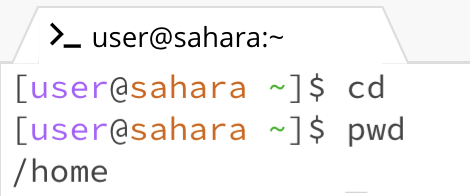
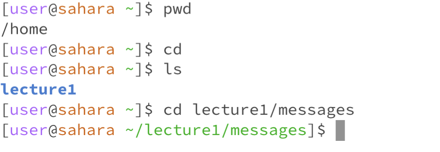
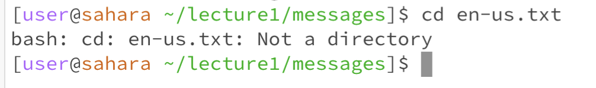

# LAB REPORT 1: SANIYA LODHA
***
## Command: cd
# 1. *cd with no arguments*

2. The working directory when running code "cd" was the home directory
3. I got no output because there were no arguments after cd so it did not change any directory and was in the same one with which we started which was home.
4. The output is not an error.

# 2. *cd with a path to a directory as an argument*

2. The working directory when the command was run was the home directory
3. By using the command "cd lecture1/messages", we changed the working directory from the home directory to the messages directory
4. There was no error

# 3. *cd with a path to a file as an argument*

2. The working directory was messages
3. After running "cd en-us.txt", it resulted in an error output because the file is not a directory.
4. There is an error because cd changes directories and en-us.txt is a file and not a directory.

## command 

