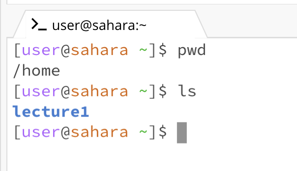

# LAB REPORT 1: SANIYA LODHA
***
## Command: cd
# 1. *cd with no arguments*

2. The working directory when running code "cd" was the home directory
3. I got no output because there were no arguments after cd so it did not change any directory and was in the same one with which we started which was home.
4. The output is not an error.

# 2. *cd with a path to a directory as an argument*

2. The working directory when the command was run was the home directory
3. By using the command "cd lecture1/messages", we changed the working directory from the home directory to the messages directory
4. There was no error

# 3. *cd with a path to a file as an argument*

2. The working directory was messages
3. After running "cd en-us.txt", it resulted in an error output because the file is not a directory.
4. There is an error because cd changes directories and en-us.txt is a file and not a directory.

## Command: ls
# 1. *ls with no arguments*

2. Working directory was the home directory
3. I got the output lecture1 because ls shows all files in the current directory which would be only lecture1 in the home directory.
4. No errors.

# 2. *ls with a path to a directory as an argument*

2. Working directory was the home directory
3. By adding a path to a directory as an argument, ls accessed the lecture1 directory and found the 4 files: Hello.class, Hello.java, messages and README which it displayed as an output.
4. We got no errors

# 3. *ls with a path to a file as an argument*

2. Working directory was the home directory
3. By adding a path to the file, we get the same argument of the path back because ls found no further files inside gd.txt
4. We got no errors

## Command: cat
# 1. *cat with no arguments*

